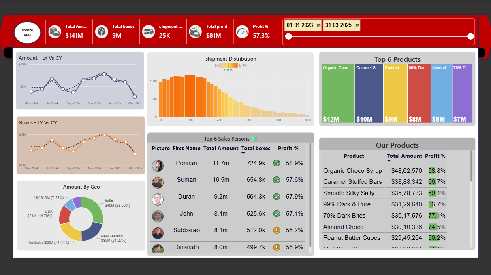

# Chocolate Sales Performance Dashboard — Power BI

## Overview
An interactive Power BI dashboard analyzing chocolate sales performance 
from Jan 2023 to Mar 2025, tracking revenue, shipments, and profitability 
across products, salespersons, and geographies.

## Key Metrics
- Total Sales: $141M
- Total Boxes Shipped: 9M
- Total Profit: $81M
- Profit Margin: 57.3%

## Features
- KPI cards for amount, boxes, shipments, and profit
- Year-over-year trend comparison (LY vs CY) for amount and boxes
- Shipment distribution histogram
- Top 6 products and top 6 salespersons ranked by amount, boxes, and profit %
- Geographic breakdown (India, USA, UK, Australia, New Zealand) via donut chart
- Interactive date-range slicer for filtering

## Tools Used
Power BI (Data Modeling, DAX Measures, Interactive Dashboards)

## Dashboard Preview

